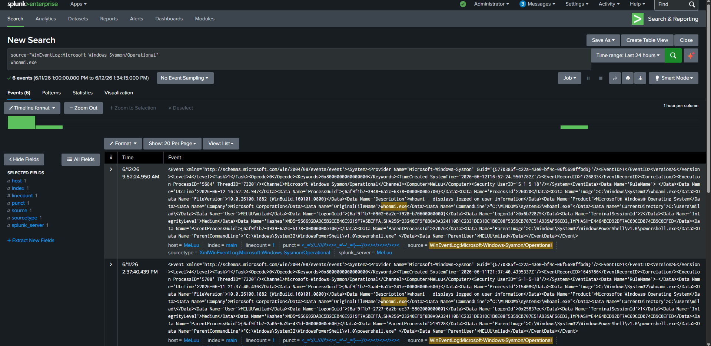
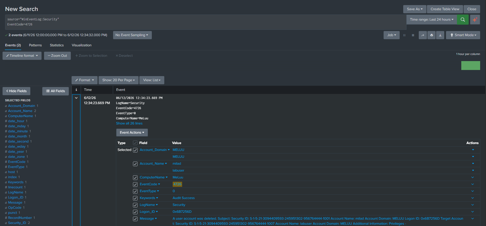
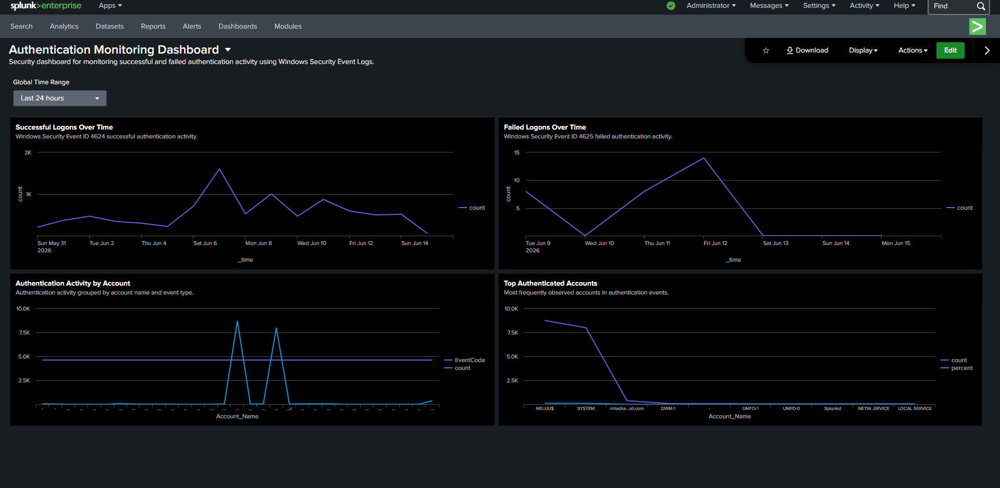
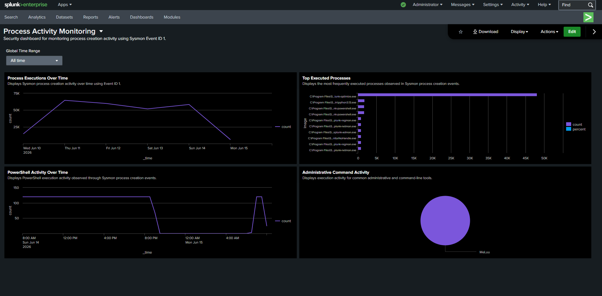
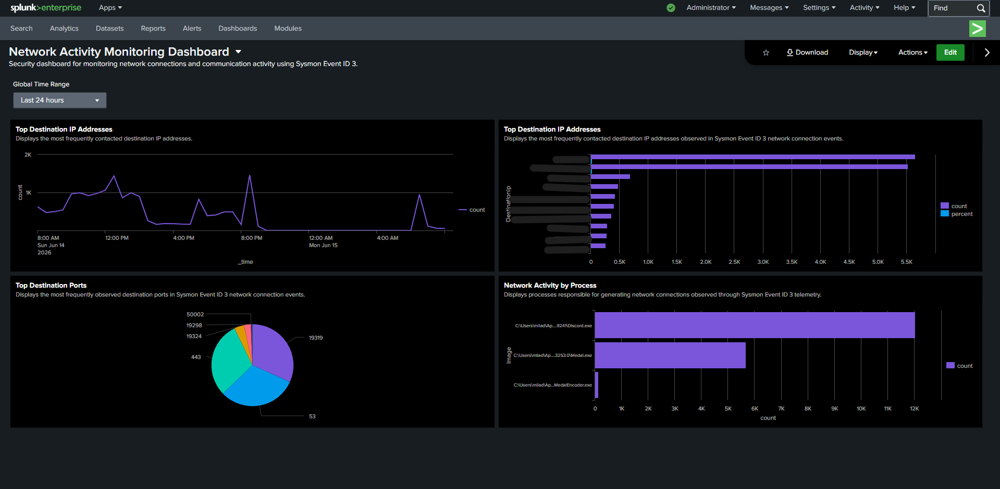

# SOC Incident Response Lab

Incident response investigations using Splunk, Sysmon, and Windows telemetry to analyze security alerts, reconstruct attack timelines, and document findings.

---

## Overview

This project focuses on incident response investigations using Splunk Enterprise, Sysmon, and Windows Event Logs.

The objective is to analyze security alerts, investigate suspicious activity, reconstruct attack timelines, and document findings using real telemetry collected in a home lab environment.

---

## Lab Environment

### Tools Used

- Splunk Enterprise
- Splunk Universal Forwarder
- Sysmon
- Windows Event Viewer
- PowerShell
- Wireshark

### Data Sources

- Microsoft-Windows-Sysmon/Operational
- Windows Security Logs
- Windows System Logs

---

## Incident Response Scenarios

### Incident 1: Suspicious PowerShell Activity

**Status:** Completed

### Incident 2: Authentication Investigation

**Status:** Completed

### Incident 3: Unauthorized Account Creation

**Status:** Completed
### Incident 4: Privileged Group Membership Change

**Status:** Completed

### Incident 5: Account Deletion Activity

**Status:** Completed
---

## Investigation Methodology

Each incident follows a structured workflow:

```text
Alert
↓
Investigation
↓
Timeline Reconstruction
↓
Findings
↓
Impact Assessment
↓
MITRE ATT&CK Mapping
↓
Recommendations
```


# Incident 1: Suspicious PowerShell Activity

## Alert

A PowerShell process was observed spawning `whoami.exe`, a command commonly used to identify the current user context on a system.

This behavior may indicate reconnaissance activity performed by an attacker after gaining access to a host.

---

## Investigation Objective

Determine whether PowerShell was used to execute reconnaissance commands and identify the associated user account, process activity, and execution timeline.

---

## Alert Query

```spl
source="WinEventLog:Microsoft-Windows-Sysmon/Operational"
"WindowsPowerShell" "whoami"
```

---

## Investigation

Process creation events were successfully collected and analyzed using Sysmon Event ID 1.

The investigation identified:

- Parent Process: powershell.exe
- Child Process: whoami.exe
- Executing User Account
- Process Command Line
- Execution Timestamp

Analysis revealed that PowerShell spawned whoami.exe, which is commonly used to identify the current user context on a system.

While this activity may be legitimate administrative behavior, it is also frequently observed during attacker reconnaissance following initial access.

---

## Timeline Reconstruction

| Time | Activity |
|--------|--------|
| T0 | powershell.exe executed |
| T1 | whoami.exe spawned by PowerShell |
| T2 | User context information retrieved |

---

## Findings

The investigation confirmed that PowerShell executed whoami.exe on the endpoint.

No additional suspicious child processes were observed during the investigation.

The activity demonstrates how attackers or administrators may use built-in Windows utilities to gather information about the current user context.

---

## Impact Assessment

- No evidence of persistence observed
- No evidence of privilege escalation observed
- No evidence of malicious payload execution observed

Risk Level: Low

---

## MITRE ATT&CK Mapping

| Technique | ID |
|------------|------------|
| System Owner/User Discovery | T1033 |
| PowerShell | T1059.001 |

---

## Recommendations

- Monitor PowerShell process activity.
- Investigate unusual parent-child process relationships involving PowerShell.
- Correlate PowerShell execution with additional reconnaissance activity.
- Enable PowerShell logging where possible.

---

## Screenshots

### PowerShell Reconnaissance Activity

PowerShell spawning whoami.exe identified through Sysmon Event ID 1 process creation telemetry.




# Incident 2: Failed Authentication Investigation

## Alert

Multiple failed authentication attempts were identified through Windows Security Event ID 4625.

Failed logon activity can indicate password guessing, brute-force attempts, misconfigured services, or unauthorized access attempts.

---

## Investigation Objective

Determine the source of the failed authentication attempts, identify the targeted account, analyze the logon type, and assess whether the activity indicates malicious behavior.

---

## Alert Query

```spl
source="WinEventLog:Security"
EventCode=4625
```

---

## Investigation

Failed authentication events were successfully collected and analyzed using Windows Security Event ID 4625.

The investigation identified:

- Targeted user accounts
- Logon types
- Authentication packages
- Failure reasons
- Source workstation information
- Associated status codes

Analysis of Event ID 4625 telemetry provided visibility into unsuccessful authentication activity occurring on the endpoint.

---

## Timeline Reconstruction

| Time | Activity |
|--------|--------|
| T0 | Authentication request initiated |
| T1 | Windows rejected authentication request |
| T2 | Event ID 4625 generated |
| T3 | Failed logon recorded in Splunk |

---

## Findings

The investigation identified failed authentication attempts against local user accounts.

Analysis revealed:

- Failed user authentication
- Audit Failure events
- Logon Type information
- Failure status codes

The activity demonstrates how Windows records unsuccessful authentication attempts and provides valuable context for identifying password attacks and unauthorized access attempts.

---

## Impact Assessment

- No successful authentication observed
- No privilege escalation observed
- No persistence observed

Risk Level: Medium

Repeated failed logons may indicate password spraying or brute-force activity and should be monitored for escalation.

---

## MITRE ATT&CK Mapping

| Technique | ID |
|------------|------------|
| Brute Force | T1110 |

---

## Recommendations

- Monitor for repeated failed authentication attempts.
- Investigate accounts experiencing excessive failures.
- Review source workstation information.
- Correlate failed logons with successful logon events.
- Implement account lockout policies where appropriate.

---

## Screenshots

### Failed Authentication Investigation

Windows Security Event ID 4625 showing failed authentication activity, logon details, and failure information collected through Splunk.


# Incident 3: Unauthorized Account Creation Investigation

## Alert

A new local user account was created on the endpoint.

Account creation activity may indicate legitimate administrative actions or unauthorized persistence mechanisms established by an attacker.

---

## Investigation Objective

Determine which account was created, identify the user responsible for the action, and assess whether the account creation activity represents legitimate administration or potential malicious behavior.

---

## Alert Query

```spl
source="WinEventLog:Security"
EventCode=4720
```

---

## Investigation

User account creation events were successfully collected and analyzed using Windows Security Event ID 4720.

The investigation identified:

- Newly created user accounts
- User responsible for account creation
- Security identifiers (SIDs)
- Account creation timestamps
- System information

Analysis of Event ID 4720 telemetry provided visibility into account lifecycle activity occurring on the endpoint.

The investigation confirmed that a new local account named `labuser` was created.

---

## Timeline Reconstruction

| Time | Activity |
|--------|--------|
| T0 | Account creation initiated |
| T1 | New local user account created |
| T2 | Windows generated Event ID 4720 |
| T3 | Event indexed into Splunk |

---

## Findings

The investigation confirmed the creation of the local account `labuser`.

Analysis revealed:

- Account Name: labuser
- Event ID: 4720
- Audit Result: Success
- User Performing Action: milad

The activity demonstrates how Windows records account creation events and provides visibility into administrative account management actions.

---

## Impact Assessment

- New local account successfully created
- Potential persistence mechanism if unauthorized
- No evidence of privilege escalation observed during this investigation

Risk Level: Medium

Account creation activity should always be reviewed to ensure authorization and legitimacy.

---

## MITRE ATT&CK Mapping

| Technique | ID |
|------------|------------|
| Create Account | T1136 |
| Local Account | T1136.001 |

---

## Recommendations

- Monitor user account creation activity.
- Investigate newly created accounts.
- Validate account ownership and authorization.
- Correlate account creation activity with privilege changes and authentication events.

---

## Screenshots

### Account Creation Investigation

Windows Security Event ID 4720 showing the creation of a new local user account and associated audit details.


# Incident 4: Privileged Group Membership Change Investigation

## Alert

A user account was added to a privileged local security group.

Changes to privileged group membership may indicate legitimate administrative activity or an attempt to escalate privileges on a system.

---

## Investigation Objective

Determine which account was added to the privileged group, identify the user responsible for the change, and assess the security impact of the modification.

---

## Alert Query

```spl
source="WinEventLog:Security"
EventCode=4732
```

---

## Investigation

Security group membership modification events were successfully collected and analyzed using Windows Security Event ID 4732.

The investigation identified:

- User accounts added to privileged groups
- Group names and associated permissions
- Security identifiers (SIDs)
- Account modification activity
- User responsible for the change

Analysis of Event ID 4732 telemetry provided visibility into privilege modification activity occurring on the endpoint.

The investigation confirmed that the account `labuser` was added to the local `Administrators` group.

---

## Timeline Reconstruction

| Time | Activity |
|--------|--------|
| T0 | Group membership modification initiated |
| T1 | User account added to Administrators group |
| T2 | Windows generated Event ID 4732 |
| T3 | Event indexed into Splunk |

---

## Findings

The investigation confirmed that the account `labuser` was added to the local `Administrators` group.

Analysis revealed:

- Account Added: labuser
- Group Name: Administrators
- Event ID: 4732
- Audit Result: Success
- User Performing Action: milad

The activity demonstrates how Windows records privileged group membership changes and provides visibility into privilege escalation opportunities.

---

## Impact Assessment

- User account received administrative privileges
- Increased access to system resources
- Potential privilege escalation vector if unauthorized

Risk Level: High

Privileged group membership changes should be reviewed to ensure authorization and legitimacy.

---

## MITRE ATT&CK Mapping

| Technique | ID |
|------------|------------|
| Account Manipulation | T1098 |

---

## Recommendations

- Monitor privileged group membership changes.
- Validate authorization for administrative privilege assignments.
- Review newly privileged accounts.
- Correlate privilege changes with account creation and authentication activity.

---

## Screenshots

### Privileged Group Membership Investigation

Windows Security Event ID 4732 showing a user account being added to the local Administrators group and associated audit details.


# Incident 5: Account Deletion Investigation

## Alert

A local user account was deleted from the endpoint.

Account deletion activity may represent legitimate administrative actions or an attempt to remove evidence of prior account usage.

---

## Investigation Objective

Determine which account was deleted, identify the user responsible for the action, and assess whether the deletion activity represents legitimate administration or potential malicious behavior.

---

## Alert Query

```spl
source="WinEventLog:Security"
EventCode=4726
```

---

## Investigation

User account deletion events were successfully collected and analyzed using Windows Security Event ID 4726.

The investigation identified:

- Deleted user accounts
- User responsible for the deletion
- Security identifiers (SIDs)
- Account lifecycle activity
- Associated system information

Analysis of Event ID 4726 telemetry provided visibility into account removal activity occurring on the endpoint.

The investigation confirmed that the account `labuser` was deleted from the local system.

---

## Timeline Reconstruction

| Time | Activity |
|--------|--------|
| T0 | Account deletion initiated |
| T1 | User account removed |
| T2 | Windows generated Event ID 4726 |
| T3 | Event indexed into Splunk |

---

## Findings

The investigation confirmed the deletion of the local account `labuser`.

Analysis revealed:

- Deleted Account: labuser
- Event ID: 4726
- Audit Result: Success
- User Performing Action: milad

The activity demonstrates how Windows records account deletion events and provides visibility into account lifecycle management.

---

## Impact Assessment

- User account successfully removed
- Access associated with the account revoked
- No evidence of malicious activity identified during the investigation

Risk Level: Medium

Account deletion activity should be reviewed to ensure authorization and legitimacy.

---

## MITRE ATT&CK Mapping

| Technique | ID |
|------------|------------|
| Create Account | T1136 |
| Local Account | T1136.001 |

---

## Recommendations

- Monitor account deletion activity.
- Validate authorization for account removal actions.
- Review account lifecycle events for unusual patterns.
- Correlate account deletions with account creation and privilege modification activity.

---

## Screenshots

### Account Deletion Investigation

Windows Security Event ID 4726 showing the deletion of a local user account and associated audit details.




# Dashboard 1: Authentication Monitoring

## Objective

Monitor successful and failed authentication activity using Windows Security Event Logs to identify authentication trends, failed login attempts, and account usage patterns.

---

## Data Sources

- Windows Security Logs
- Event ID 4624 (Successful Logon)
- Event ID 4625 (Failed Logon)

---

## Dashboard Components

### Successful Logons Over Time

Displays successful authentication activity using Windows Security Event ID 4624.

**Search:**

```spl
source="WinEventLog:Security"
EventCode=4624
| timechart count
```

### Failed Logons Over Time

Displays failed authentication attempts using Windows Security Event ID 4625.

**Search:**

```spl
source="WinEventLog:Security"
EventCode=4625
| timechart count
```

### Authentication Activity by Account

Displays authentication activity grouped by user account.

**Search:**

```spl
source="WinEventLog:Security"
(EventCode=4624 OR EventCode=4625)
| stats count by Account_Name
| sort - count
```

### Top Authenticated Accounts

Displays the most frequently observed accounts involved in authentication events.

**Search:**

```spl
source="WinEventLog:Security"
(EventCode=4624 OR EventCode=4625)
| top Account_Name
```

---

## Findings

The dashboard provides visibility into:

- Successful authentication activity
- Failed authentication attempts
- Frequently used accounts
- Authentication trends over time
- User account activity patterns

The dashboard can assist analysts in identifying abnormal authentication behavior, brute-force attempts, unauthorized account usage, and suspicious login activity.

---

## Screenshots

### Authentication Monitoring Dashboard

Authentication monitoring dashboard displaying successful logons, failed logons, account activity, and top authenticated accounts.




# Dashboard 2: Process Activity Monitoring

## Objective

Monitor process creation activity using Sysmon Event ID 1 to identify process execution trends, PowerShell usage, administrative command execution, and frequently executed processes.

---

## Data Sources

- Microsoft-Windows-Sysmon/Operational
- Sysmon Event ID 1 (Process Creation)

---

## Dashboard Components

### Process Executions Over Time

Displays Sysmon process creation activity over time.

**Search:**

```spl
source="WinEventLog:Microsoft-Windows-Sysmon/Operational"
"<EventID>1</EventID>"
| timechart count
```

### Top Executed Processes

Displays the most frequently executed processes observed in Sysmon process creation events.

**Search:**

```spl
source="WinEventLog:Microsoft-Windows-Sysmon/Operational"
"<EventID>1</EventID>"
| rex field=_raw "Name='Image'>(?<Image>[^<]+)"
| top Image
```

### PowerShell Activity Over Time

Displays PowerShell execution activity observed through Sysmon process creation events.

**Search:**

```spl
source="WinEventLog:Microsoft-Windows-Sysmon/Operational"
"<EventID>1</EventID>"
powershell.exe
| timechart count
```

### Administrative Command Activity

Displays execution activity for common administrative and command-line tools.

**Search:**

```spl
source="WinEventLog:Microsoft-Windows-Sysmon/Operational"
"<EventID>1</EventID>"
(whoami.exe OR powershell.exe OR cmd.exe)
| stats count by host
```

---

## Findings

The dashboard provides visibility into:

- Process creation activity
- Frequently executed processes
- PowerShell execution trends
- Administrative command usage
- Endpoint process behavior

The dashboard can assist analysts in identifying suspicious process execution, PowerShell abuse, command-line activity, and unusual endpoint behavior during investigations and threat hunting activities.

---

## Screenshots

### Process Activity Monitoring Dashboard

Process activity monitoring dashboard displaying process creation activity, top executed processes, PowerShell activity, and administrative command execution.




# Dashboard 3: Network Activity Monitoring

## Objective

Monitor network connection activity using Sysmon Event ID 3 to identify communication patterns, frequently contacted destinations, commonly used ports, and processes generating network traffic.

---

## Data Sources

- Microsoft-Windows-Sysmon/Operational
- Sysmon Event ID 3 (Network Connection)

---

## Dashboard Components

### Network Connections Over Time

Displays Sysmon network connection activity over time.

**Search:**

```spl
source="WinEventLog:Microsoft-Windows-Sysmon/Operational"
"<EventID>3</EventID>"
| timechart count
```

### Top Destination IP Addresses

Displays the most frequently contacted destination IP addresses observed in Sysmon Event ID 3 network connection events.

**Search:**

```spl
source="WinEventLog:Microsoft-Windows-Sysmon/Operational"
"<EventID>3</EventID>"
| rex field=_raw "Name='DestinationIp'>(?<DestinationIp>[^<]+)"
| top DestinationIp
```

### Top Destination Ports

Displays the most frequently observed destination ports in Sysmon Event ID 3 network connection events.

**Search:**

```spl
source="WinEventLog:Microsoft-Windows-Sysmon/Operational"
"<EventID>3</EventID>"
| rex field=_raw "Name='DestinationPort'>(?<DestinationPort>[^<]+)"
| top DestinationPort
```

### Network Activity by Process

Displays processes responsible for generating network connections observed through Sysmon Event ID 3 telemetry.

**Search:**

```spl
source="WinEventLog:Microsoft-Windows-Sysmon/Operational"
"<EventID>3</EventID>"
| rex field=_raw "Name='Image'>(?<Image>[^<]+)"
| stats count by Image
| sort - count
```

---

## Findings

The dashboard provides visibility into:

- Network connection activity over time
- Frequently contacted destination IP addresses
- Commonly used network ports
- Processes generating network traffic
- Endpoint communication behavior

The dashboard can assist analysts in identifying suspicious outbound connections, unusual network destinations, abnormal port usage, and processes responsible for network communications during threat hunting and incident response activities.

---

## Screenshots

### Network Activity Monitoring Dashboard

Network activity monitoring dashboard displaying network connections, destination IP addresses, destination ports, and process-generated network activity.



---

## Note

Several Sysmon fields were stored within raw XML event data. Custom field extractions using Splunk `rex` were implemented to extract network-related fields for dashboard visualizations and analysis.

---
